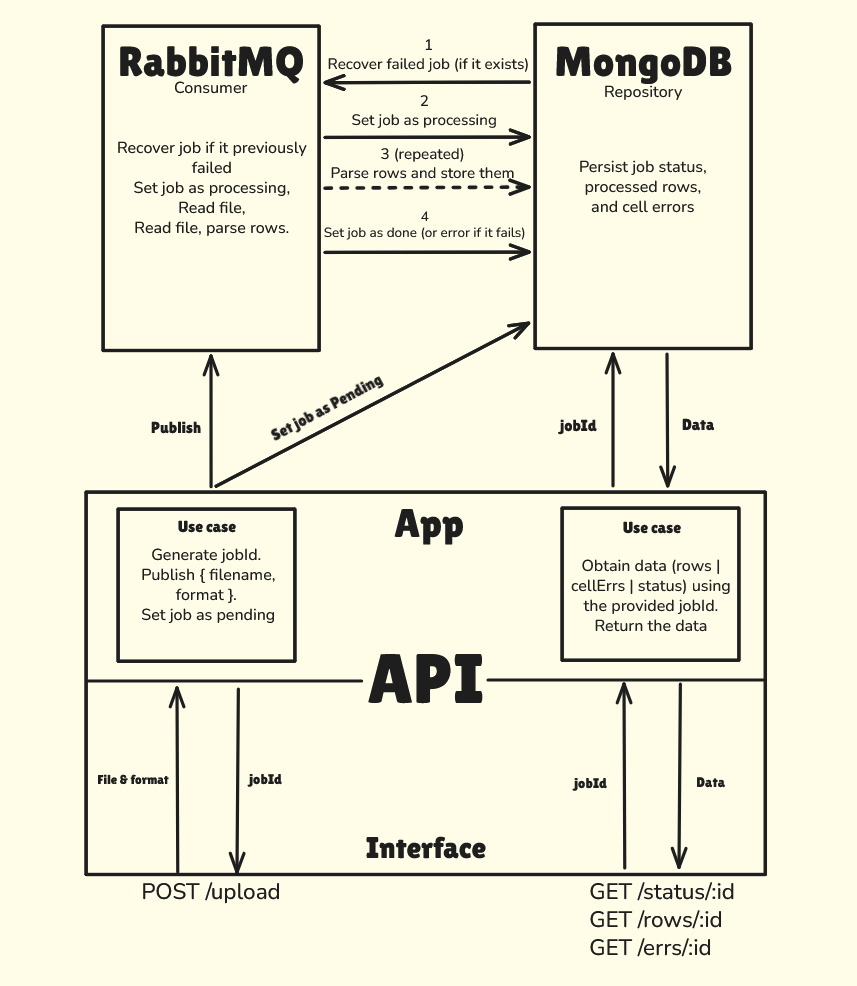

# Nest-excel

Nest-excel es un lector de archivos XLSX
que recibe un formato de parseo y un archivo,
valida y parsea las filas para finalmente persistirlas.

## Inicialización

Se puede levantar todos los servicios (DB + Rabbit + API):

```bash
docker-compose up -d
```

O bien, levantar solo MongoDB y RabbitMQ, y luego iniciar la API manualmente:

```bash
docker-compose up -d mongodb rabbitmq && yarn start
```

## Uso

A través del endpoint `POST /upload` con el header `multipart/form-data`
se envían los campos `file` y `format` para subir un archivo `xlsx`, el cual será leído
y parseado usando el `format` dado. <br>
Este responderá con un ID que se utilizará para consultar el estado del trabajo y
obtener el resultado de las filas y errores de celda.

El formato debe ser:

```json
{ "columna": "Tipo" }
```

e.g.:

```json
{
  "name": "String",
  "age": "Number",
  "nums?": "Array<Number>"
}
```

Y debe ser enviado como `string`.

- Tipos soportados: `String`, `Number`, `Boolean`, `Date`
- Cada uno de los tipos puede ser un array: `Array<Number>`, `Array<Boolean>`, ...
- Añadir un `?` al final de la columna la hace opcional.
- Los nombres de las columnas son case sensitive.

## Endpoints

Cuando se realiza una llamada a la API, esta responderá con un JSON
que contendrá **siempre** un campo `ok`. Si este es `true`, existirá el campo `response`,
de lo contrario, existirá `err`.

`response` depende de la respuesta que devuelva cada endpoint.

```json
{
  "ok": true,
  "response": {}
}
```

`err` siempre comparte la misma estructura.

```json
{
  "ok": false,
  "err": {
    "reason": "something went wrong",
    "status": 500,
    "code": "INTERNAL"
  }
}
```

<details>
<summary>POST /upload</summary>

##### Request

Recibe `multipart/form-data` con dos campos:

- `file`: Archivo XLSX a procesar.
- `format`: Formato de parseo. Se envía como string.

##### Response

_`jobId: string` ID del trabajo. utilizado para recuperar el estado o datos_

```json
{
  "ok": true,
  "response": {
    "jobId": "43e0ccad-f014-458f-a15e-2cc3e754a676"
  }
}
```

</details>

<details>
<summary>GET /status/:id</summary>

#### Request

Se debe proveer el ID del trabajo por URL

e.g.: `/status/43e0ccad-f014-458f-a15e-2cc3e754a676`

#### Response

Se pueden devolver diferentes resultados
dependiendo del valor `status` del trabajo. <br>
Los cuales pueden ser: `pending`, `processing`, `done`, `error`.

_`status: string` estado actual del trabajo_ <br>
_`cols: string[]` columnas tenidas en cuenta._ <br>
_`totalRows: number` número de filas a procesar._ <br>
_`rowCount: number` número de filas procesadas._ <br>
_`cellErrCount: number` número de errores de celda._ <br>
_`finishedAt: string (ISO 8601)` cuando terminó de procesar_ <br>
_`reason: string` motivo del error_ <br>

`status = pending:`

```json
{
  "ok": true,
  "response": {
    "status": "pending"
  }
}
```

`status = processing:`

Los contadores representan el progreso actual.

```json
{
  "ok": true,
  "response": {
    "status": "processing",
    "cols": ["name", "age", "nums"],
    "totalRows": 17000,
    "rowCount": 3000,
    "cellErrCount": 0
  }
}
```

`status = done:`

```json
{
  "ok": true,
  "response": {
    "status": "done",
    "cols": ["name", "age", "nums"],
    "rowCount": 17000,
    "cellErrCount": 30,
    "finishedAt": "2026-02-19T21:45:30.123Z"
  }
}
```

`status = error:`

```json
{
  "ok": true,
  "response": {
    "status": "error",
    "reason": "Table has no valid columns",
    "finishedAt": "2026-02-19T21:45:30.123Z"
  }
}
```

</details>

<details>
<summary>GET /rows/:id</summary>

#### Request

Se debe proveer el ID del trabajo por URL <br>
Este endpoint permite URL Queries para paginación.

- `take` -- Límite de resultados
- `page` -- Número de pagina.
- `desc` -- Orden descendente.

e.g.: `/rows/43e0ccad-f014-458f-a15e-2cc3e754a676?take=10&page=2&desc=true`

#### Response

Se devuelve un array con las filas procesadas mapeadas dinámicamente
por el formato dado por el usuario.

Si el formato es:

```json
{
  "name": "String",
  "age": "Number",
  "nums?": "Array<Number>"
}
```

entonces `response` será e.g.:

_el `response` aquí es un **Array**_ <br>
_`name: string`_ <br>
_`age: number`_ <br>
_`nums: number[]`_ <br>

```json
{
  "ok": true,
  "response": [
    { "name": "name1", "age": 43, "nums": [1, 2, 5, 6, 8] },
    { "name": "name2", "age": 52 },
    { "name": "name3", "age": 24, "nums": [32, 55, 75, 94] }
  ]
}
```

</details>

<details>
<summary>GET /errs/:id</summary>

#### Request

Se debe proveer el ID del trabajo por URL <br>
Este endpoint permite URL Queries para paginación.

- `take` -- Límite de resultados
- `page` -- Número de pagina.
- `desc` -- Orden descendente.

e.g.: `/errs/43e0ccad-f014-458f-a15e-2cc3e754a676?take=10&page=2&desc=true`

#### Response

Se devuelve un array de objetos que indican
la posición de celda en la que ocurrió un error de parseo.

- _el `response` aquí es un **Array**_ <br>
- _`col: number` índice de columna del error_ <br>
- _`row: number` índice de fila del error_ <br>

e.g.:

```json
{
  "ok": true,
  "response": [
    { "col": 3, "row": 43 },
    { "col": 2, "row": 59 },
    { "col": 1, "row": 84 }
  ]
}
```

</details>

## Arquitectura

Se utiliza `Typescript` como lenguaje y `NestJS` como framework. <br>
Ademas se utiliza `RabbitMQ` como sistema de mensajeria
para evitar bloquear el gateway y asegurar la persistencia de los datos con `MongoDB`. <br>

El siguiente diagrama muestra el flujo de manera sencilla.

